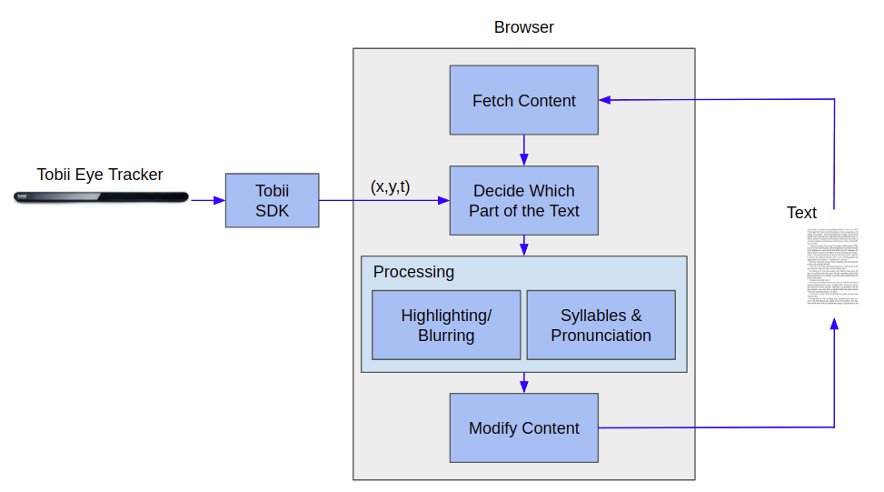

# rtracker
rtracker is a reading assistive tool based on eye tracking, especially to help people with [dyslexia](http://dyslexia.yale.edu/dyslexia/what-is-dyslexia/). These readers have difficulties in tracking lines and breaking up words into syllables. Targeting at these symptoms, we are trying to develop an interactive tool based on eye tracking. Our tool is different from others in the highly interactive way between readers and material - instead of requiring the readers to manually clicking or taking notes, our tool analyze and adjust display according to the reading focus automatically.

The features of rtracker include:
- Fundamental Features
	- Using [Tobii Eye Tracker 4C](https://tobiigaming.com/product/tobii-eye-tracker-4c/) to track eye focus and displaying text on browser
	- Highlighting the current line and blurring the rest lines
	- Popping up syllables for word the readers have difficulty with
- Nice-to-have Features
	- Pronunciation of syllables
	- Hands free scrolling and navigation
	- Working with user-uploaded PDF, image and any URL link
- Further features
	- Transfer all the features to [Magic Leap](https://www.magicleap.com/), applying our idea to AR

## Project Architecture
Technically, we are trying to build a browser extension which receives real-time eye focus coordinations from Tobii and modifying text display on the browser accordding to it. The technical architecture of the project is shown in the following figure.

There are 3 main difficuties in this project.

## Project Management
View our progress on [Github Project](https://github.com/Orienfish/rtracker/projects/1).